# Weather and Crime

## The Question

This project is an exploration of the interaction
  of weather and crime in Chicago.
It is initially motivated by the
  strong seasonal variation observed the crime rate for Chicago.
By presenting stable crime rates for cities without cold winters,
  I suggest that temperature -- rather than daylight or summer schedules --
  is the relevant pathway for this seasonal effect.
In the context of a regression for Chicago crime, 
  the coefficients on temperature and precipitation are large and significant.
I thus reproduce earlier results in this realm.
After removing the secular trends over time,
  temperature is responsible for around 60% of the residual
  variation in the rates of battery, theft, and assault.

Towards the end of the investigation, 
  I analyze the outliers in the distribution and 
  suggest various alternative specifications.
I evaluate which types of crime are most related to temperature.

### Past Work

Past work has validated the intuitive premise that crime rises with temperature.
Recent studies by [Ranson](https://doi.org/10.1016/j.jeem.2013.11.008), and
  [Gamble and Hess](https://dx.doi.org/10.5811%2Fwestjem.2012.3.11746) in the context of climate change,
  have found strong positive correation of temperature with crime.
Both find that the slope falls with increasing temperature.
However, these and earlier work by [Field](http://www.jstor.org/stable/23637533) (1992)
  was at the monthly level.
This project therefore benefits from more-precise data
  and can probe daily variation in temperature and precipitation.
Field's work at the monthly level for England and Wales 
  failed to identify a significant effect of rainfall,
  whereas the daily analysis presented here finds a stark effect.

## Data

Check-out scripts for the data in this analysis can be found in my [`data`](https://github.com/JamesSaxon/data/) repository.

### City Crime Data

I have downloaded data from 10 major US cities with public crime data portals
  that report crimes with a time and location.
While I focus the analysis on Chicago, 
  I do use data Dallas, San Francisco, Phoenix, and Philadelphia
  to separate out seasonal variations from temperature variation.
The datasets used are:
* [Chicago](https://data.cityofchicago.org/view/5cd6-ry5g)
* [San Francisco](https://data.sfgov.org/Public-Safety/SFPD-Incidents-from-1-January-2003/tmnf-yvry)
* [Dallas](https://www.dallasopendata.com/Public-Safety/Police-Incidents/tbnj-w5hb/data)
* [Phoenix](https://www.phoenix.gov/opendata)
* [Philadelphia](https://www.opendataphilly.org/dataset/crime-incidents/resource/d6369e07-da6d-401b-bf6e-93fdfacdf24d)
* [Los Angeles](https://data.lacity.org/A-Safe-City/Crimes-2012-2015/s9rj-h3s6/data)
* [Portland](http://www.civicapps.org/datasets/)
* [New York City](https://data.cityofnewyork.us/Public-Safety/NYPD-7-Major-Felony-Incidents/hyij-8hr7)
* Boston [2012-2015](https://data.cityofboston.gov/Public-Safety/Crime-Incident-Reports-July-2012-August-2015-Sourc/7cdf-6fgx) and [2015-present](https://data.cityofboston.gov/Public-Safety/Crime-Incident-Reports-August-2015-To-Date-Source-/fqn4-4qap)
* [Denver](http://data.denvergov.org/download/gis/crime/csv/crime.csv)

A check-out script for all of these data is found here:

[**`data/crime/download`**](https://github.com/JamesSaxon/data/blob/master/crime/download)

The reporting periods vary widely between cities.
Records in Chicago and San Francisco go back to 2001 and 2003;
  while those for Dallas and Phoenix start in just 2014 and 2015.
The definition of crimes also varies.
For example Chicago and Philadelphia report crimes,
  New York reports seven major felonies,
  Phoenix reports nine major felonies, and 
  San Francisco and Dallas include non-criminal responses.
I remove non-criminal offenses in the analysis.

I could also have used the FBI's Uniform Crime Reports,
  but these are aggregate to the monthly level.

### Weather Underground API

The Weather Underground API provides 
  an outstanding interface for retrieving historical weather data:
 
* https://www.wunderground.com/weather/api/
  
The service provides hourly weather data for major US airports
  at the hourly level, dating further back than any of the crime datasets.
A free account provides 500 calls per day and 10 calls per minute.
Each call returns one day worth of day, usually with 24 hourly observations.
A script is provided that downloads one airport and year (365 calls, every 7 seconds),
  and which can be run daily:

[**`data/weather/download.py`**](https://github.com/JamesSaxon/data/blob/master/weather/download.py)

This script retains the complete json response for each call,
  and also extracts a daily csv "reduction,"
  that includes only the observation times, temperatures, and precipitation.
It is then trivial to `cat` together a complete record for a city.

I have downloaded complete records for Chicago and Phoenix.

## Investigation

All analysis code for this project is included in a single jupyter notebook:

[weather_crime.ipynb](https://github.com/harris-ippp/lectures/blob/master/09-weather/weather_crime.ipynb)

The bulk of the analysis is performed in python, pandas and statsmodels,
  but I do use command line tools to reduce the data volume.
These calls are also contained within the notebook.

### Comparison of Cities

The observation that motivates this analysis is the strong seasonal variation in Chicago crime rates,
  which correlates in an obvious way with temperature:

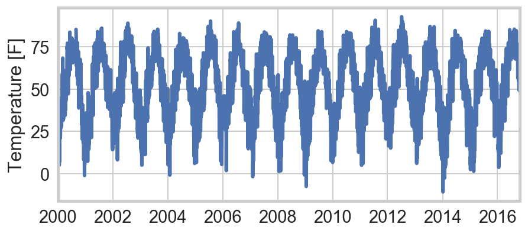 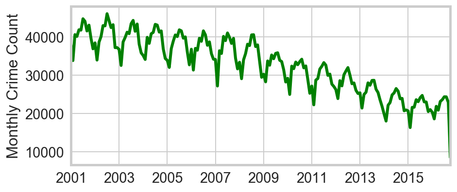

The first question is whether temperature is truly the "culprit,"
  or if instead the variation is simply seasonal.
Are we simply seeing more kids off from school?
Or more houses unattended while families take vacations?
Or longer evening hours?
Monthly crime rates for San Francisco, Phoenix, and Dallas
  have far less severe winters and exhibit no notable cycles in crime rates.
By contrast other northern cities like Philadelphia do.
This provides strong circumstantial evidence that temperature is the relevant factor.

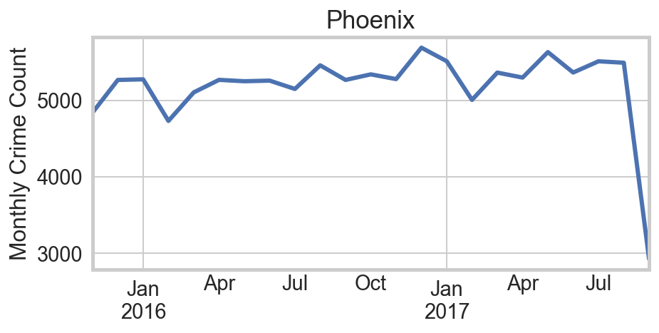 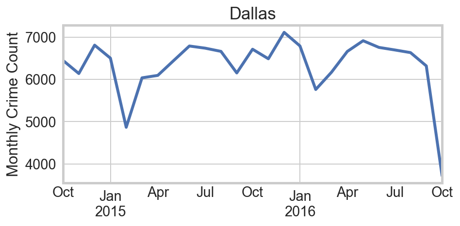 
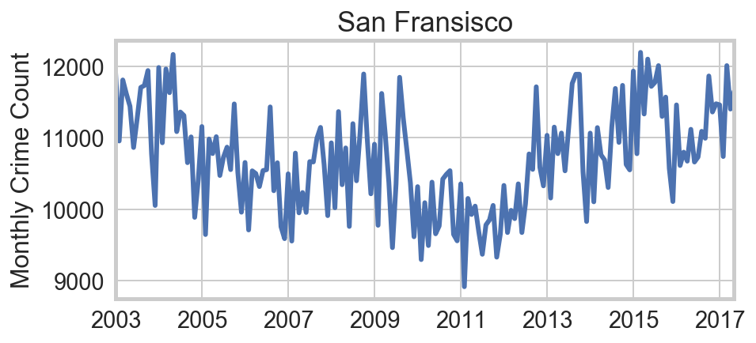 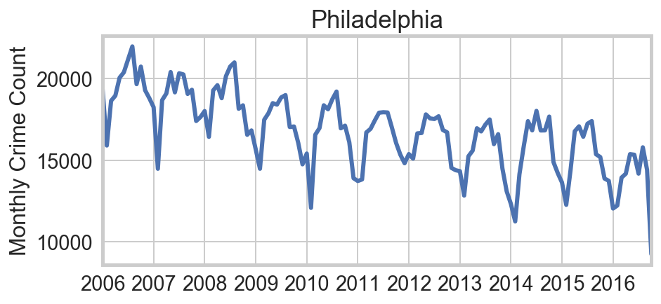

### Regression Analysis

The initial regression to report is simply daily crime rates on
  average (daily) temperature in Chicago.
The regression displays a very clear trend but with enormous, non-normal residuals.

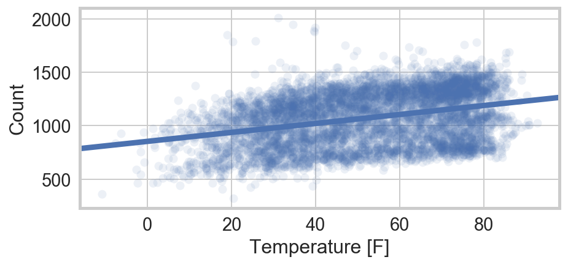

The obviously missing factor is the secular reductions in crime.
To address this, yearly fixed effects and a linear time trend are almost equally effective.
I choose the non-parametric approach (fixed-effects).

#### The Baseline Model

In addition to the secular trend,
  we have seen before that crime rates exhibit strong weekly cyclicity.
I therefore include yearly and day-of-week fixed effects.
I also include a dummy for precipitation.
The main item of interest is the coefficient on the temperature.
Because I am curious as to the effect of hot _relative_ days,
  I also include the difference in the daily average with the average of the days before and after.
I use the average of both neighboring days instead of simply the preceding day,
  to ensure that the variable is distributed around zero.
Looking simply at the difference with respect to the preceding day
  shows seasonal fluctuations as on average it gets warmer in the spring and cooler in the fall.

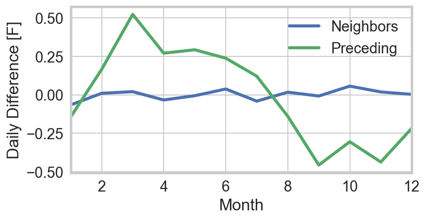

All in all, with year _y_, day of week _w_, temperature _T_, and "daily difference" as DD, the the model is:

_Crime ~ αyw + βTT + βDDDD_

The results are as follows:

<table class="simpletable">
<caption>OLS Regression Results</caption>
<tr>
  <th>Dep. Variable:</th>           <td>NC</td>        <th>  R-squared:         </th> <td>   0.888</td> 
</tr>
<tr>
  <th>Model:</th>                   <td>OLS</td>       <th>  Adj. R-squared:    </th> <td>   0.887</td> 
</tr>
<tr>
  <th>Method:</th>             <td>Least Squares</td>  <th>  F-statistic:       </th> <td>   1884.</td> 
</tr>
<tr>
  <th>Date:</th>             <td>Sat, 30 Sep 2017</td> <th>  Prob (F-statistic):</th>  <td>  0.00</td>  
</tr>
<tr>
  <th>Time:</th>                 <td>22:14:03</td>     <th>  Log-Likelihood:    </th> <td> -33576.</td> 
</tr>
<tr>
  <th>No. Observations:</th>      <td>  5750</td>      <th>  AIC:               </th> <td>6.720e+04</td>
</tr>
<tr>
  <th>Df Residuals:</th>          <td>  5725</td>      <th>  BIC:               </th> <td>6.737e+04</td>
</tr>
<tr>
  <th>Df Model:</th>              <td>    24</td>      <th>                     </th>     <td> </td>    
</tr>
<tr>
  <th>Covariance Type:</th>      <td>nonrobust</td>    <th>                     </th>     <td> </td>    
</tr>
</table>
<table class="simpletable">
<tr>
         <td></td>            <th>coef</th>     <th>std err</th>      <th>t</th>      <th>P>|t|</th>  <th>[0.025</th>    <th>0.975]</th>  
</tr>
<tr>
  <th>Intercept</th>       <td> 1081.4429</td> <td>    6.049</td> <td>  178.778</td> <td> 0.000</td> <td> 1069.584</td> <td> 1093.301</td>
</tr>
<tr>
  <th>C(Yint)[T.2002]</th> <td>    4.1555</td> <td>    6.199</td> <td>    0.670</td> <td> 0.503</td> <td>   -7.997</td> <td>   16.308</td>
</tr>
<tr>
  <th>C(Yint)[T.2003]</th> <td>  -14.6876</td> <td>    6.200</td> <td>   -2.369</td> <td> 0.018</td> <td>  -26.841</td> <td>   -2.534</td>
</tr>
<tr>
  <th>C(Yint)[T.2004]</th> <td>  -40.2627</td> <td>    6.194</td> <td>   -6.500</td> <td> 0.000</td> <td>  -52.405</td> <td>  -28.120</td>
</tr>
<tr>
  <th>C(Yint)[T.2005]</th> <td>  -86.5471</td> <td>    6.198</td> <td>  -13.964</td> <td> 0.000</td> <td>  -98.697</td> <td>  -74.397</td>
</tr>
<tr>
  <th>C(Yint)[T.2006]</th> <td> -103.9345</td> <td>    6.197</td> <td>  -16.772</td> <td> 0.000</td> <td> -116.083</td> <td>  -91.786</td>
</tr>
<tr>
  <th>C(Yint)[T.2007]</th> <td> -129.3048</td> <td>    6.197</td> <td>  -20.864</td> <td> 0.000</td> <td> -141.454</td> <td> -117.155</td>
</tr>
<tr>
  <th>C(Yint)[T.2008]</th> <td> -148.2334</td> <td>    6.197</td> <td>  -23.920</td> <td> 0.000</td> <td> -160.382</td> <td> -136.085</td>
</tr>
<tr>
  <th>C(Yint)[T.2009]</th> <td> -238.5630</td> <td>    6.203</td> <td>  -38.458</td> <td> 0.000</td> <td> -250.724</td> <td> -226.402</td>
</tr>
<tr>
  <th>C(Yint)[T.2010]</th> <td> -313.0629</td> <td>    6.197</td> <td>  -50.516</td> <td> 0.000</td> <td> -325.212</td> <td> -300.914</td>
</tr>
<tr>
  <th>C(Yint)[T.2011]</th> <td> -360.6227</td> <td>    6.198</td> <td>  -58.179</td> <td> 0.000</td> <td> -372.774</td> <td> -348.471</td>
</tr>
<tr>
  <th>C(Yint)[T.2012]</th> <td> -425.2000</td> <td>    6.195</td> <td>  -68.640</td> <td> 0.000</td> <td> -437.344</td> <td> -413.056</td>
</tr>
<tr>
  <th>C(Yint)[T.2013]</th> <td> -477.9702</td> <td>    6.200</td> <td>  -77.098</td> <td> 0.000</td> <td> -490.124</td> <td> -465.817</td>
</tr>
<tr>
  <th>C(Yint)[T.2014]</th> <td> -561.6879</td> <td>    6.202</td> <td>  -90.571</td> <td> 0.000</td> <td> -573.845</td> <td> -549.530</td>
</tr>
<tr>
  <th>C(Yint)[T.2015]</th> <td> -608.9072</td> <td>    6.197</td> <td>  -98.254</td> <td> 0.000</td> <td> -621.056</td> <td> -596.758</td>
</tr>
<tr>
  <th>C(Yint)[T.2016]</th> <td> -621.5207</td> <td>    6.657</td> <td>  -93.357</td> <td> 0.000</td> <td> -634.572</td> <td> -608.469</td>
</tr>
<tr>
  <th>C(DoW)[T.1]</th>     <td>   19.9642</td> <td>    4.110</td> <td>    4.857</td> <td> 0.000</td> <td>   11.906</td> <td>   28.022</td>
</tr>
<tr>
  <th>C(DoW)[T.2]</th>     <td>   28.6811</td> <td>    4.110</td> <td>    6.979</td> <td> 0.000</td> <td>   20.624</td> <td>   36.738</td>
</tr>
<tr>
  <th>C(DoW)[T.3]</th>     <td>   19.0278</td> <td>    4.111</td> <td>    4.628</td> <td> 0.000</td> <td>   10.968</td> <td>   27.088</td>
</tr>
<tr>
  <th>C(DoW)[T.4]</th>     <td>   78.4653</td> <td>    4.114</td> <td>   19.075</td> <td> 0.000</td> <td>   70.401</td> <td>   86.529</td>
</tr>
<tr>
  <th>C(DoW)[T.5]</th>     <td>   17.6794</td> <td>    4.112</td> <td>    4.299</td> <td> 0.000</td> <td>    9.618</td> <td>   25.741</td>
</tr>
<tr>
  <th>C(DoW)[T.6]</th>     <td>  -43.8975</td> <td>    4.112</td> <td>  -10.676</td> <td> 0.000</td> <td>  -51.958</td> <td>  -35.837</td>
</tr>
<tr>
  <th>C(P)[T.True]</th>    <td>  -29.8673</td> <td>    2.377</td> <td>  -12.564</td> <td> 0.000</td> <td>  -34.527</td> <td>  -25.207</td>
</tr>
<tr>
  <th>T</th>               <td>    4.5349</td> <td>    0.058</td> <td>   78.593</td> <td> 0.000</td> <td>    4.422</td> <td>    4.648</td>
</tr>
<tr>
  <th>DD</th>              <td>   -0.9165</td> <td>    0.251</td> <td>   -3.656</td> <td> 0.000</td> <td>   -1.408</td> <td>   -0.425</td>
</tr>
</table>

The model has a high R² of 0.89.  

* The yearly fixed effects show spectacular yearly reductions in crime, over the past fourteen years.
* The day-of-week fixed effects show crime peaking on Friday (4) and at its lowest on Sundays (6), as usual.
* Temperature has a positive and extremely significant effect on crime (t = 79).
* Precipitation leads to a large and highly significant (_t_ = 13) reduction in the daily crime rates.
* These effects are so large that there is no doubt as to the impact of weather, and little need for more-subtle tests.  Nevertheless, alternative specifications can alter somewhat the values of of the coefficients.
* The coefficient on the "daily difference" is negative and moderately significant, but for alternative specifications can be consistent with 0.

#### Observations on the Residuals

The residuals of the full fit are dramatically smaller than the original temperature v. crime fit.
However, at low temperature they are non-normal and tend to be negative.
Fitting a non-parametric, locally-weighted linear regresion to the component + residual data, 
  the slope of the fit line indeed falls with temperature.
This confirms the intuition that "at a certain point, even criminals start to melt."
This behavior has previously been observed, in the work noted above.

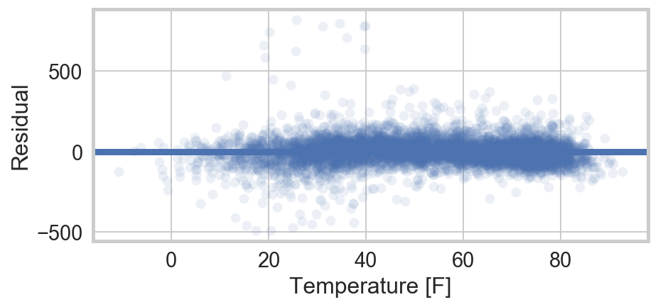 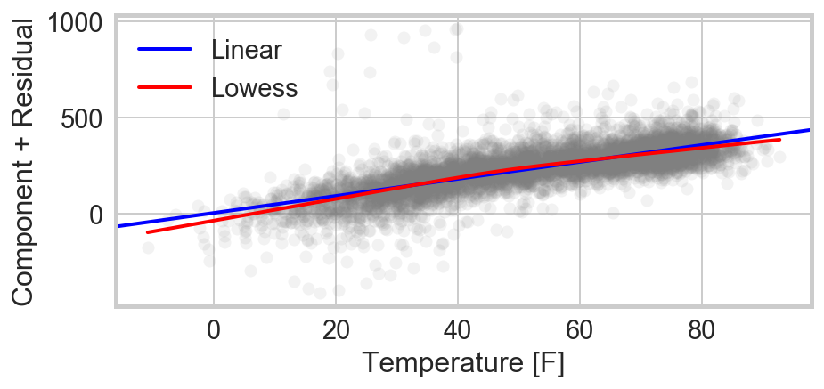

Also notable in the residuals is the presence of a dozen or so outliers,
  with crime levels far from the trend and outside the distribution.
We now turn to those days with more than 400 more crimes than nominally predicted.

### Outliers Identified: New Year's Day.

It turns out that every single one of these days is a New Year's Day (2002-2015).
One might naturally worry about a data reporting issue:
  some crimes that did not have a definite time, could simply be set to January 1.
This does not appear to be the case.
Although there is a spate of crimes at midnight,
  this appears to correspond to reporting at the end of the shift --
  not to a technical problem.
Comparing the crime rate on New Year's to the rest of the month,
  we see a fairly uniform rise in the rate across types.
In particular, the normal "heavy hitters" of theft and batter 
  have high ratios with respect to the normal expectations for January
  and make up for the bulk of the increase.
The additional crime is not concentrated in, for instance, financial crimes,
  that might have different reporting procedures.

<table class="dataframe">
  <thead>
    <tr style="text-align: right;">
      <th></th>
      <th>Offense</th>
      <th>January</th>
      <th>NYD</th>
      <th>ratio</th>
    </tr>
  </thead>
  <tbody>
    <tr>
      <th>0</th>
      <td>THEFT</td>
      <td>99632</td>
      <td>6107</td>
      <td>1.900163</td>
    </tr>
    <tr>
      <th>1</th>
      <td>BATTERY</td>
      <td>82358</td>
      <td>5034</td>
      <td>1.894825</td>
    </tr>
    <tr>
      <th>2</th>
      <td>NARCOTICS</td>
      <td>60640</td>
      <td>1398</td>
      <td>0.714677</td>
    </tr>
    <tr>
      <th>3</th>
      <td>CRIMINAL DAMAGE</td>
      <td>51790</td>
      <td>2677</td>
      <td>1.602375</td>
    </tr>
    <tr>
      <th>4</th>
      <td>OTHER OFFENSE</td>
      <td>34592</td>
      <td>1953</td>
      <td>1.750202</td>
    </tr>
    <tr>
      <th>5</th>
      <td>BURGLARY</td>
      <td>28125</td>
      <td>718</td>
      <td>0.791396</td>
    </tr>
    <tr>
      <th>6</th>
      <td>ASSAULT</td>
      <td>26698</td>
      <td>957</td>
      <td>1.111207</td>
    </tr>
    <tr>
      <th>7</th>
      <td>MOTOR VEHICLE THEFT</td>
      <td>25005</td>
      <td>803</td>
      <td>0.995521</td>
    </tr>
    <tr>
      <th>8</th>
      <td>DECEPTIVE PRACTICE</td>
      <td>19260</td>
      <td>1527</td>
      <td>2.457788</td>
    </tr>
    <tr>
      <th>9</th>
      <td>ROBBERY</td>
      <td>18942</td>
      <td>636</td>
      <td>1.040862</td>
    </tr>
  </tbody>
</table>

Nevertheless, there are a few notable exceptions: 
  crime types with increases far above the global ~80%.
Namely, there are overwhelming spikes in sexual crimes and crimes involving children.

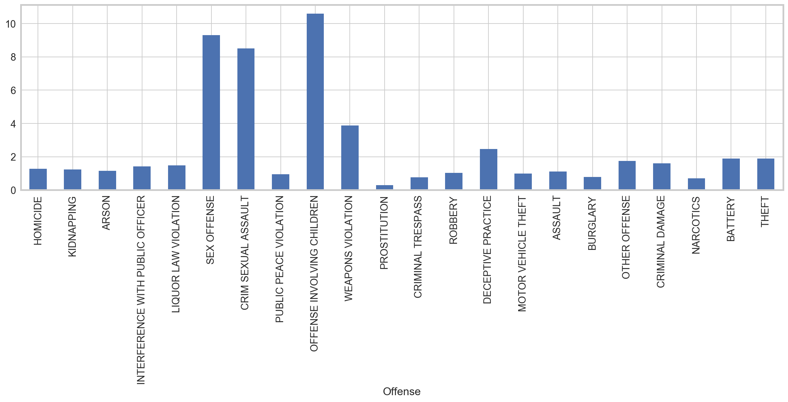

### A Non-Linear Model

Next, we turn to a non-linear model for crime,
  as suggested by the non-normal residuals.
Since I am particularly interested in identifying the turn-over
  where it might get "too hot for crime,"
  I focus here on crime in the afternoon (from noon to 6pm),
  when it might really get "too hot."
I allow for a linear coefficient for the year.
We can see the effect we are trying to fit either 
  by plotting a profile plot of the temperature after subtracting off the trend in the year,
  or by plotting the component plus residuals of a Count ~ Year + Time model.
In both cases, there is an apparent change in the slope at around 50° F.

 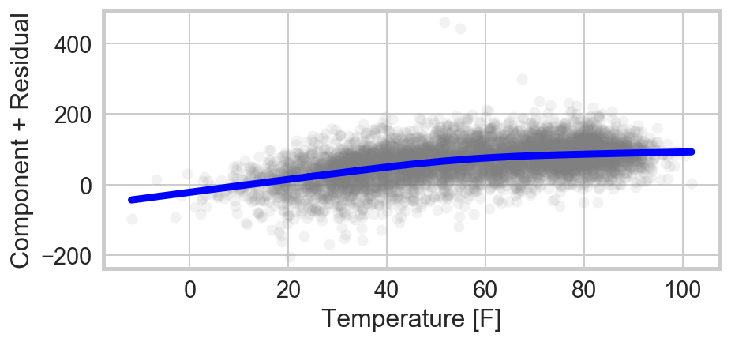 

Since `statsmodels` isn't built for this type of fit, I have used `lmfit`
  to fit a piecewise function with 

The model indeed fits a sharp drop in the slope at 51.7±1.6° F,
  from 2.0±0.1 to 0.6±0.1 crimes per degree fahrenheit.

Alternative specifications for this behavior, for example as a quadratic,
  did not reliably converge.

Note that as specified, this model still fits a single absolute reduction in crime across years,
  rather than a percentage fluctuation
The latter specification would potentially be more appropriate, but is not natural with `statsmodels`.

### The Most-Susceptible Types of Crime

Finally, it is natural to ask if there are specific type of crimes that are more-susceptible
  to the temperature than others.
For this, I calculate the partial regressions on the residuals of the 
  crime ~ year fit, for the 20 most common types of crime.
I tabulate the ten crime types (of the 20 common types)
  with the highest partial correlations after removing the secular, yearly trend.
For each of battery, assault, and theft, the correlations 
  is around 60%.

<table class="dataframe">
  <thead>
    <tr style="text-align: right;">
      <th></th>
      <th>Offense</th>
      <th>R</th>
      <th>p</th>
    </tr>
  </thead>
  <tbody>
    <tr>
      <th>0</th>
      <td>BATTERY</td>
      <td>0.604118</td>
      <td>0.0</td>
    </tr>
    <tr>
      <th>1</th>
      <td>ASSAULT</td>
      <td>0.587209</td>
      <td>0.0</td>
    </tr>
    <tr>
      <th>2</th>
      <td>THEFT</td>
      <td>0.522527</td>
      <td>0.0</td>
    </tr>
    <tr>
      <th>3</th>
      <td>CRIMINAL DAMAGE</td>
      <td>0.506202</td>
      <td>0.0</td>
    </tr>
    <tr>
      <th>4</th>
      <td>GAMBLING</td>
      <td>0.416715</td>
      <td>0.0</td>
    </tr>
    <tr>
      <th>5</th>
      <td>ROBBERY</td>
      <td>0.355936</td>
      <td>0.0</td>
    </tr>
    <tr>
      <th>6</th>
      <td>BURGLARY</td>
      <td>0.312967</td>
      <td>0.0</td>
    </tr>
    <tr>
      <th>7</th>
      <td>PUBLIC PEACE VIOLATION</td>
      <td>0.267490</td>
      <td>0.0</td>
    </tr>
    <tr>
      <th>8</th>
      <td>WEAPONS VIOLATION</td>
      <td>0.256215</td>
      <td>0.0</td>
    </tr>
    <tr>
      <th>9</th>
      <td>MOTOR VEHICLE THEFT</td>
      <td>0.174238</td>
      <td>0.0</td>
    </tr>
  </tbody>
</table>

## Conclusions

This study reproduces past results that find increases in crime rates with temperature.
By using crime and weather data aggregated at daily frequency,
  we also find tha precipitation puts a strong brake on crime.
The crimes most susceptible to this temperature effect are battery, assault, theft and criminal damage.
After accounting for the secular trends in crime rates, temperature is responsible
  for more than half of the remaining variation in the daily rates of these crime types, in Chicago.

We have explored alternative specifications, and confirmed that there is indeed a "ceiling" on this effect:
  higher temperatures correlate with higher crime, but the effect is smaller for days that are already very hot.
  

